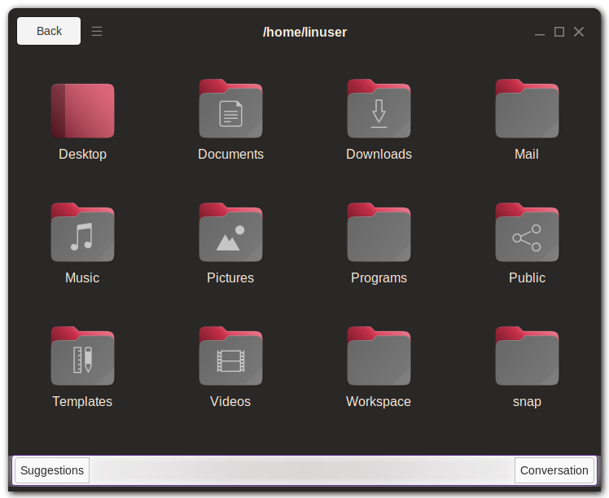

Aerome File Manager
===================



Aerome is a cross platform file manager that helps you sort, manage, and manipulate your files much faster with the help of an AI assistant.

You can see a demo at [the Aerome website](https://aerome.net).

## Installation

Aerome runs on both Linux and macOS. For now though, official releases are only available for Linux.

### From a Release

The quickest way to install Aerome is from a release build:

1. Download the latest release from the [releases page](https://github.com/AeromeFileManager/aerome/releases).
2. Extract the archive to your desired location.
3. Run it! Yeah that's it.

### From source

Aerome is a Rust project, so you'll have to have to have the [Rust toolchain](https://www.rust-lang.org/tools/install) installed first. After installing that just clone the repository:

```sh
git clone https://github.com/AeromeFileManager/aerome.git
```

and then build + run Aerome

```sh
cd aerome
cargo run --release
```

## License

This project is licensed under the GPLv3 License. See the [LICENSE](https://github.com/AeromeFileManager/aerome/blob/master/LICENSE) file for more information.
